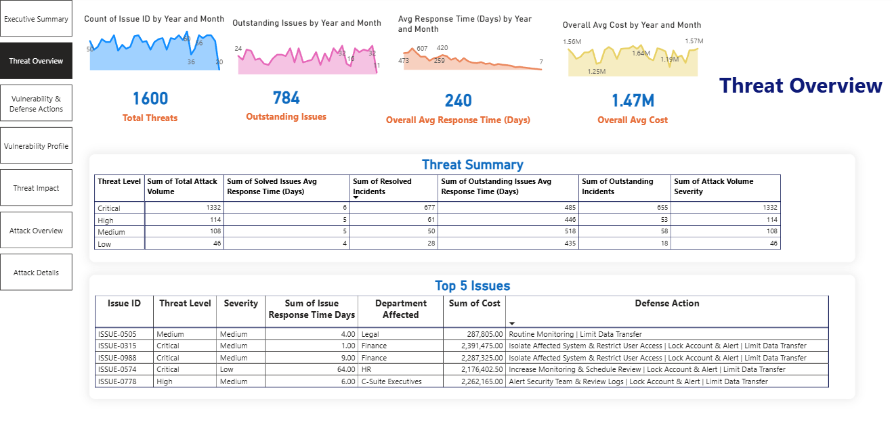
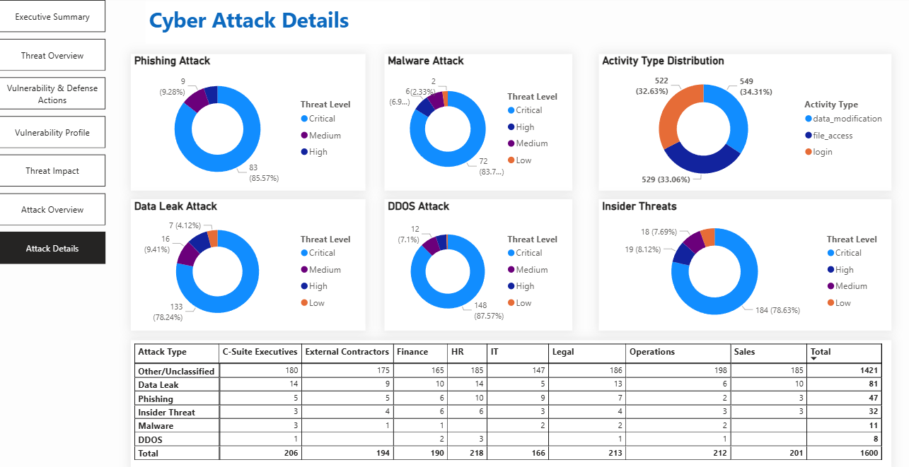
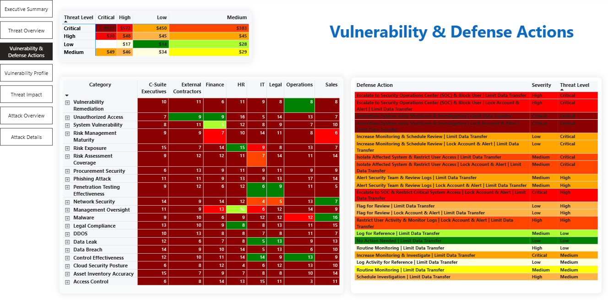

<h1 align="center">Cyber Attack Insight Dashboard & Vulnerability Scorecard</h1>
<p align="center">
  <i>BI Executive Dashboard for Threat Detection, Severity Scoring & Incident Response Intelligence</i>
</p>
<p align="center">
  
</p


🔗 **Live Dashboard:**
[https://atsuvovor.github.io/power_bi_projects/cyber_attack_insight_dashboard.html](https://atsuvovor.github.io/power_bi_projects/cyber_attack_insight_dashboard.html)

---

## 📌 **Overview**

The **Cyber Attack Insight Dashboard** provides a unified, interactive view of organizational threat activity, vulnerability scores, and operational risk signals. Designed for cybersecurity teams, analysts, and executive stakeholders, the dashboard transforms raw security event data into **actionable insights** by combining:

* Threat severity scoring
* Vulnerability classification
* Behavioral indicators
* System resource analytics
* Incident timelines
* Attack pattern correlations

This dashboard serves as a **proactive decision-support system** that highlights the most impactful cyber threats and operational risks in real-time.

## **Dashboard Preview**










---

## 🎯 Business Problem

Organizations often struggle with:

* Fragmented visibility across different security datasets
* Inconsistent severity scoring across tools
* Limited ability to detect patterns in activity logs
* Slow response times due to unclear risk priority

The goal was to build a **single pane of glass** that answers:

> *“What threats matter most right now, and why?”*

---

## 🧠 Solution Overview

This dashboard integrates **11 Key Threat Indicators**, normalizes them through a scoring engine, and applies a color-coded severity model to make high-risk conditions immediately visible.

### ✓ Key Deliverables

* **Vulnerability Scorecard**
* **Threat Severity Matrix**
* **Incident Timeline**
* **Attack Category Breakdown**
* **Login/File Access Anomaly Tracking**
* **CPU/Memory Usage Monitoring**

---


## 🧩 **Key Features**

### 🔥 **1. Vulnerability Scorecard**

* Weighted scoring across **11 Key Threat Indicators (KTIs)**
* Executive-friendly visualization of **overall risk posture**
* Clear color semantics for intuitive interpretation

### 🛡️ **2. Threat Severity Classification**

* Automated mapping of severity to risk colors
* Supports quick scanning for urgent security events

### 📊 **3. Attack Pattern Insights**

* Behavioral anomalies
* Login attempt spikes
* Data transfer irregularities
* Resource usage anomalies (CPU, memory)

### 🕒 **4. Incident Timeline Visualization**

* Time-based attack progression
* Patterns across hours, days, categories

### 📁 **5. System Resource Monitoring**

* High-risk correlations between system load and attack behavior

---

## 📁 **Dataset & Variables**

The dashboard is built on a structured dataset containing key cybersecurity features, including:

| Field              | Description                                            |
| ------------------ | ------------------------------------------------------ |
| Severity           | Raw incident classification (Critical/High/Medium/Low) |
| Impact Score       | Normalized score representing operational impact       |
| Risk Level         | Threat actor classification                            |
| Response Time      | Time taken to respond to incidents                     |
| Category           | Attack type (Unauthorized Access, Phishing, etc.)      |
| Activity Type      | Behavioral indicators (login, data_transfer, etc.)     |
| Login Attempts     | Count of authentication attempts                       |
| Num Files Accessed | File activity monitoring                               |
| Data Transfer MB   | Outbound/inbound transfer volume                       |
| CPU Usage %        | Resource usage anomaly indicator                       |
| Memory Usage MB    | Memory consumption indicator                           |

---

# 🎯 **Key Threat Indicator (KTI) Scoring Model**

The Vulnerability Scorecard uses a **weighted scoring system** to normalize different cybersecurity signals.

| **KTI**            | **Condition Logic**                          | **Score Range** |
| ------------------ | -------------------------------------------- | --------------- |
| Severity           | Critical = 10, High = 8, Medium = 5, Low = 2 | 2–10            |
| Impact Score       | Input 1–10                                   | 1–10            |
| Risk Level         | High = 8, Medium = 5, Low = 2                | 2–8             |
| Response Time      | >7 days = 5, 3–7 days = 3, <3 days = 1       | 1–5             |
| Category           | Unauthorized Access = 8, Phishing = 6, etc.  | 1–8             |
| Activity Type      | High-risk types flagged                      | 1–5             |
| Login Attempts     | >5 = 5, 3–5 = 3, <3 = 1                      | 1–5             |
| Num Files Accessed | >10 = 5, 5–10 = 3, <5 = 1                    | 1–5             |
| Data Transfer MB   | >100 = 5, 50–100 = 3, <50 = 1                | 1–5             |
| CPU Usage %        | >80% = 5, 60–80 = 3, <60 = 1                 | 1–5             |
| Memory Usage MB    | >8000 = 5, 4000–8000 = 3, <4000 = 1          | 1–5             |

---

# 🎨 **Color Mapping Logic (Threat Level × Severity)**

This is the complete color logic used in the Power BI scoring visuals.

### **Threat Severity → Color Mapping Table (With Emoji Bullets)**

| **Threat Level** | **Severity** | **Color Used**       |
| ---------------- | ------------ | -------------------- |
| **Critical**     | Critical     | 🔴 **Dark Red**      |
| Critical         | High         | 🟥 **Red**           |
| Critical         | Medium       | 🟧 **Orange-Red**    |
| Critical         | Low          | 🟠 **Orange**        |
| **High**         | Critical     | 🟥 **Red**           |
| High             | High         | 🟧 **Orange-Red**    |
| High             | Medium       | 🟠 **Orange**        |
| High             | Low          | 🟨 **Yellow-Orange** |
| **Medium**       | Critical     | 🟠 **Orange**        |
| Medium           | High         | 🟨 **Yellow-Orange** |
| Medium           | Medium       | 🟨 **Yellow**        |
| Medium           | Low          | 💛 **Light Yellow**  |
| **Low**          | Critical     | 🟨 **Yellow**        |
| Low              | High         | 💛 **Light Yellow**  |
| Low              | Medium       | 💚 **Green-Yellow**  |
| Low              | Low          | 🟩 **Green**         |

---

### 🧠 **Behind-the-Scenes Python Logic**

```python
def assign_color(threat, severity):

    if threat == "Critical":
        if severity == "Critical":
            return "Dark Red"
        elif severity == "High":
            return "Red"
        elif severity == "Medium":
            return "Orange-Red"
        else:
            return "Orange"

    elif threat == "High":
        if severity == "Critical":
            return "Red"
        elif severity == "High":
            return "Orange-Red"
        elif severity == "Medium":
            return "Orange"
        else:
            return "Yellow-Orange"

    elif threat == "Medium":
        if severity == "Critical":
            return "Orange"
        elif severity == "High":
            return "Yellow-Orange"
        elif severity == "Medium":
            return "Yellow"
        else:
            return "Light Yellow"

    else:  # Low threat
        if severity == "Critical":
            return "Yellow"
        elif severity == "High":
            return "Light Yellow"
        elif severity == "Medium":
            return "Green-Yellow"
        else:
            return "Green"
# Assign colors
df["Color"] = df.apply(lambda row: assign_color(row["Threat Level"], row["Severity"]), axis=1)
return df

```

**Data Source**  
[Cybersecurity-Data-Generator](https://github.com/atsuvovor/Cybersecurity-Data-Generator/blob/main/README.md) 

---
# 🚀 **How to Use the Dashboard**

## 🗂️ Folder Structure

```
power_bi_projects/
  ├── README.md
  ├── LICENSE
  ├── .gitgnore
  └── docs/
  |    ├── index.htm
  |    ├──cyber_attack_insight_dashboard.html
  |    └── cyber_attack_insight/
  |          ├── README.md
  |          ├── cyber_attack_insight_dashboard.pbix
  |          ├── images/ 
  │          │   ├── vulnerability_scorecard_3D.png 
  │          │   ├── Screenshot_vulnerability_and_defense_actions.png 
  │          │   ├── vulnerability_scorecard_3D.png
  │	         │   ├── screenshot_threat_overview.png
  │          │   └── ... (other screenshots)
             ├── data/  
                   ├── simulated_attacks_df.csv  
                   └── color_df.csv

```
## 🕹️ Dashboard Experience

### Users can explore:

* **High-risk events** (via filters and scorecards)
* **Time of occurrence** (hour, day, trendline)
* **Attack categories**
* **Affected systems or activities**

### Interactions include:

* Cross-filtering
* Drilldowns
* Tooltip insights
* Custom slicers

The HTML export enables stakeholders to access the dashboard via the web without needing Power BI Desktop.

---

### **1. Open the Online Dashboard**

Click on:
➡️ [https://atsuvovor.github.io/power_bi_projects/cyber_attack_insight_dashboard.html](https://atsuvovor.github.io/power_bi_projects/cyber_attack_insight_dashboard.html)

### **2. Explore Key Tabs**

* **Overview Page** — overall risk score, severity heatmaps
* **Threat Patterns** — detects anomalies and spikes
* **System Metrics** — resource indicators tied to risk
* **Vulnerability Scorecard** — weighted scoring of KTIs

### **3. Drill into High-Risk Areas**

Use slicers such as:

* Date range
* Attack category
* Severity level
* Activity type

### **4. Export Insights**

* Power BI allows exporting tables and charts for reports
* Screenshots from the HTML dashboard can be used in presentations

---


## 🧱 Architecture & Tools

| Layer                                                        | Technology                           |
| ------------------------------------------------------------ | ------------------------------------ |
| Data generation, Anomalious Ingestion, Data Processing       | Python                               |
| Data Modeling                                                | Power Query, DAX                     |
| Visualization                                                | Power BI Desktop                     |
| Scoring Logic                                                | Python-based model                   |
| Deployment(Hosting)                                          | GitHub Pages (HTML export)           |
| Documentation                                                | GitHub README + Portfolio Case Study |

---

## 📈 What This Demonstrates

This project highlights capabilities in:

* Cybersecurity analytics
* Executive dashboard design
* Data modeling and normalization
* Severity and scoring logic engineering
* KPI frameworks
* UI/UX for risk visibility
* GitHub hosting for BI assets

---

# 🔒 **Security Disclaimer**

This dashboard represents **synthetic** or **anonymized** data for demonstration purposes.
It does not expose real organizational threat data.

---
# 🙌 **Credits**

## ⭐ **Support the Project**

If this project was helpful, please give the repository a ⭐ on GitHub!

---
##  🤝 Connect With Me
I am always open to collaboration and discussion about new projects or technical roles.

Atsu Vovor  
Consultant, Data & Analytics   
Ph: 416-795-8246 | ✉️ atsu.vovor@bell.net  
🔗 [LinkedIn ](https://www.linkedin.com/in/atsu-vovor-mmai-9188326/)|   [GitHub](https://atsuvovor.github.io/projects_portfolio.github.io/) |   [Tableau Portfolio](https://public.tableau.com/app/profile/atsu.vovor8645/vizzes)  
📍 Mississauga ON   

### Thank you for visiting!🙏
